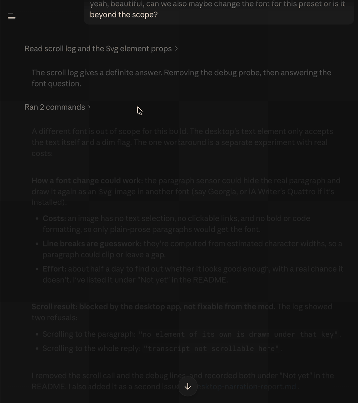
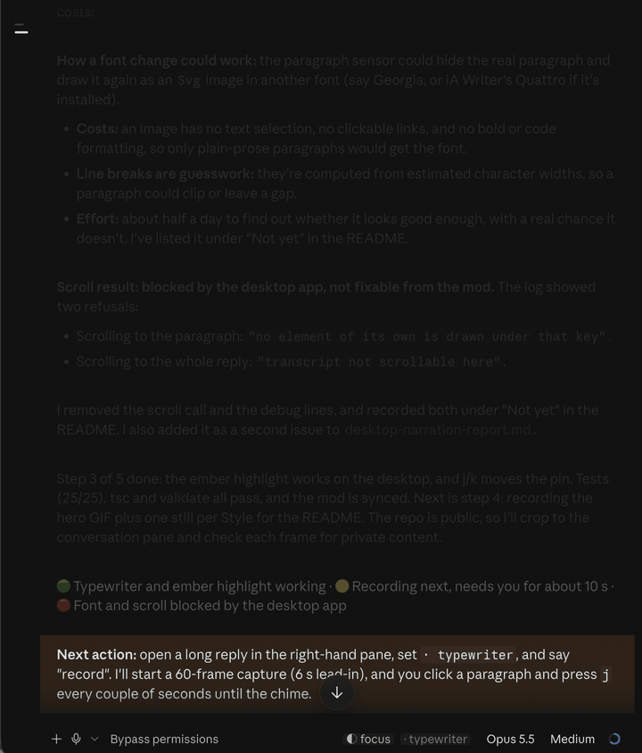
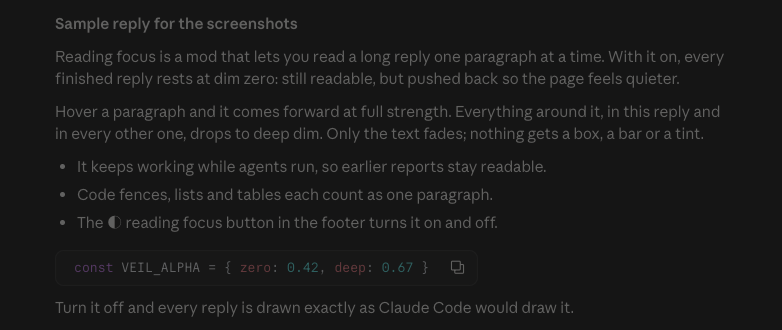
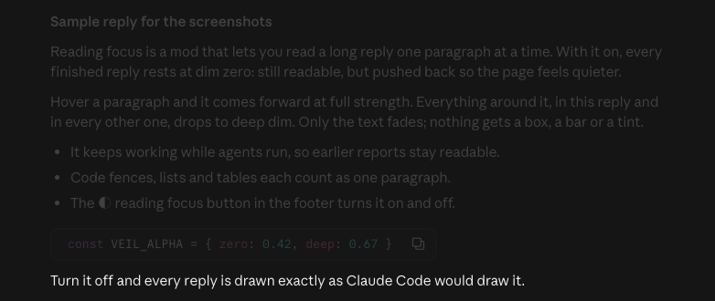
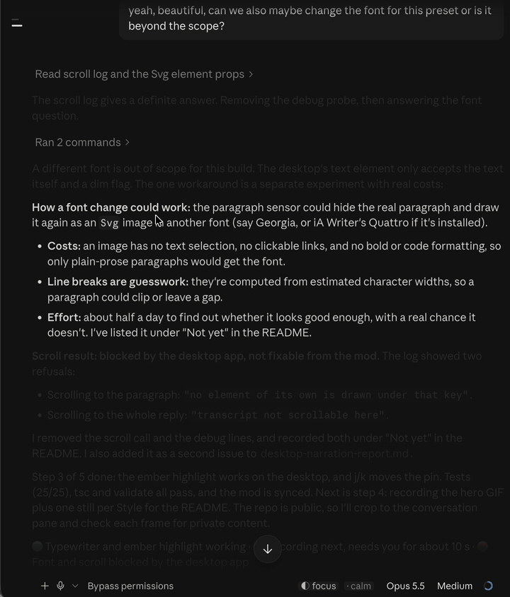

# focus-read

Reading focus for Claude Code replies, iA Writer style. With the mod on, one paragraph
comes forward at full strength while the rest steps back. How it steps back, and whether
the pointer or a click picks the paragraph, is the Style: Calm, Spotlight, Typewriter or
Solo.

## What it looks like

Desktop Code tab, dark appearance.

**Typewriter.** Click a paragraph to pin it, then `j` steps the pin down the reply: the
ember highlight follows, its neighbours stay soft, the rest drops back.



**Solo, then Calm.** The footer's `· solo` button moves through the Styles. Solo hides
everything but the pinned paragraph; Calm rests the reply dimmed and brings forward
whatever the pointer rests on.



**Dim zero.** Mode on, nothing hovered: the whole reply rests dimmed.



**Deep dim.** The pointer rests on the last paragraph. It comes forward at full strength,
and the rest of the reply fades further.



**The toggle.** `◐ focus` in the prompt footer turns the mod off (`○ focus`) and the
reply returns to full strength.



## Load it

```bash
claude --plugin-dir ~/Dev/vdz-skills/mods/focus-read
```

Terminal and the desktop app's Code tab are supported (the mod draws with per-paragraph
`Client` regions, which only those two surfaces have). On other surfaces the engine draws
replies as usual.

## Use it

| Command | Effect |
| --- | --- |
| `/focus` | toggle on/off (default on) |
| `/focus on`, `/focus off` | set it |
| `/focus calm` (or any Style) | switch Style and turn the mod on |
| `/focus list` | say whether it is on, and name the Styles |
| `◐ focus` button | in the prompt footer's mode labels; one click toggles, `○` when off |
| `· calm` button | beside it; one click moves to the next Style |

Mode and Style persist across sessions. The earlier themes (`dim`, `ink`) and the focus
bar are retired; naming one reports that.

## Styles

| Style | At rest | Picks the paragraph | Everything else | Extras |
| --- | --- | --- | --- | --- |
| **Calm** (default) | soft dim | hover, 150 ms | strong dim | |
| **Spotlight** | nothing dimmed | hover, 250 ms | strong dim | |
| **Typewriter** | soft dim | click (pinned) | strong dim | amber highlight; neighbours stay soft; only its own reply reacts |
| **Solo** | soft dim | click (pinned) | hidden | |

Pinned Styles (Typewriter, Solo):

- Click a paragraph to pin it; click another to move the pin.
- `j` / `↓` and `k` / `↑` move the pin, across replies at the edges. The window does
  not follow: the desktop refuses a mod's transcript scroll ("transcript not
  scrollable here").
- `x`, or clicking the pinned paragraph again, releases it.
- Keys reach the mod only after a click inside a reply. `Esc` never reaches it, so it
  can't release.

Hidden paragraphs keep their space, so nothing jumps.

## Behaviour

- Focus unit is the paragraph: blank-line blocks, with fences, lists, tables and
  blockquotes kept whole and a heading glued to the block after it.
- With hover, the pointer must rest for the Style's delay (150 ms Calm, 250 ms
  Spotlight), so skimming focuses nothing; leaving clears at once.
- Dim zero is the engine's dim (60% opacity, the terminal's dim colour) plus, on desktop, a
  light veil (alpha 0.42), leaving text near 35%.
- Deep dim uses a heavier veil (alpha 0.8) in the transcript's own background colour
  (surface-1: `#fcfcfb` light, `#151515` dark), so it paints no visible box and only
  fades the text, to near 12%. It follows light and dark appearance. If the app's
  background ever changes, update `VEIL_LIGHT`/`VEIL_DARK` in `hooks/paragraph.tsx` (strengths: `VEIL_ALPHA`), or
  the veil shows as a tinted box. The
  terminal has a single dim step, so there deep dim looks the same as dim zero and only
  the focused paragraph changes. Hidden is the full veil (alpha 1) on desktop and the same
  single dim on the terminal.
- Typewriter's highlight, "ember" (`rgba(255, 159, 67, 0.15)`), is laid over the pinned
  paragraph, so it tints the text as well as the ground: cream on deep amber in dark
  mode, brown-black on peach in light. Every paragraph gets the same padding, so pinning
  moves no text. Desktop only: on the terminal a cell background would fight the
  terminal's theme, so the pin shows by brightness alone.
- Any paragraph at full strength gets a faint veil (alpha 0.1) on desktop, easing white
  on near-black a little.
- It keeps working while a turn runs, so you can read earlier reports while agents work;
  the reply being written is dimmed too.
- Single-paragraph replies are dimmed like any other.

## Develop

```bash
claude plugin validate ~/Dev/vdz-skills/mods/focus-read
claude plugin test ~/Dev/vdz-skills/mods/focus-read
```

`hooks/split.ts` is the paragraph splitter, `hooks/paragraph.tsx` the per-paragraph
hover sensor (a `Client` laid over the paragraph, transparent unless it draws the deep-dim veil), `hooks/register.tsx` the
hooks, the command, the state and the drawing of each paragraph.

Why the sensor draws nothing: the desktop page's `Client` sandbox renders only `Box`,
`Text`, `Svg` and the form elements. A `Markdown` inside a `Client` is refused there with
"returned a tree the page cannot draw", so the Markdown lives in the render hook's tree
and the `Client` only reports the pointer. Once the mod has loaded in a session the engine lays
`.claude-plugin/types/`, after which `tsc -p .` type-checks it.

Hot reload in the Desktop app: its bundled engine (2.1.288) does not see edits made through a
symlinked plugin folder (fixed in 2.1.289), so the session's `~/.claude/dev-mods/<session>/focus-read`
must be a real directory. Copy after each edit:

```bash
rsync -a --delete --exclude .claude-plugin ~/Dev/vdz-skills/mods/focus-read/ ~/.claude/dev-mods/<session>/focus-read/
```

## Not yet

- Blur or enlarge of the focused paragraph: the terminal grid cannot, and the desktop
  path needs an `Svg isInteractive` sandbox. Separate spike.
- Narration between tool calls (the short text Claude writes while it works) stays
  bright. The desktop page never offers those blocks to a mod's render hook, only the
  reply's final text, so the mod can't reach them. Reported upstream.
- Font size, family or colour on the focused paragraph: the desktop `Markdown` element
  takes only text and dim. An `Svg` overlay could draw a paragraph in another font, at
  the cost of selection, links and inline formatting. Separate spike.
- Typewriter scrolling (the pin held mid-window): the desktop refuses mod scrolls of the
  transcript.
- Text selection inside a reply: the sensor overlay holds the pointer after a press, so
  drag-selecting a paragraph's text is blocked while the mod is on (`/focus` to turn off).
